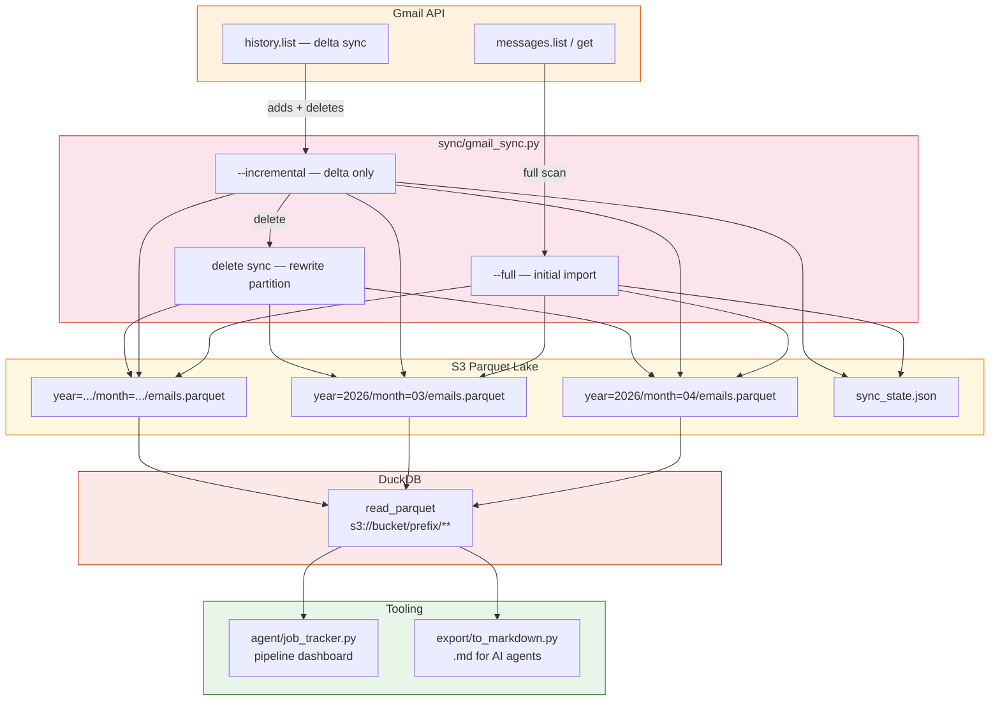
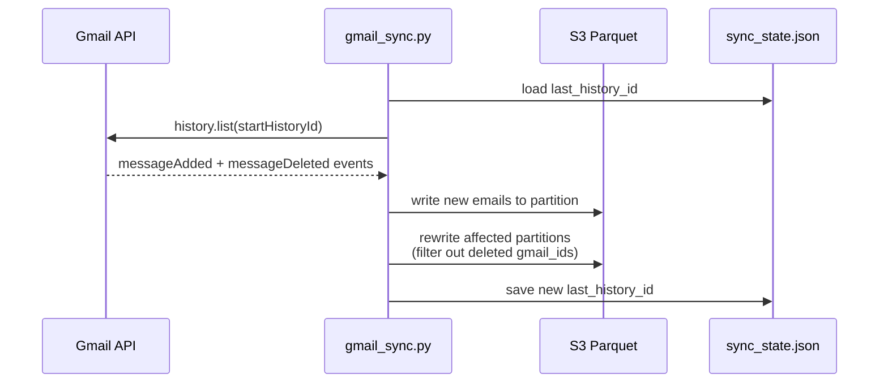

# mail-parquet-lake

Sync Gmail to Parquet on S3. Query with DuckDB. Track job search pipeline. AI-reviewed on every PR.

## Architecture



## Delete Sync



## Stack

- **Gmail API** — incremental sync via `history.list` (delta, not full scan)
- **Parquet on S3** — columnar storage, partitioned by year/month
- **DuckDB** — query engine, reads S3 Parquet natively, no server
- **Pandas** — result shaping, export formatting
- **Terraform** — IAM OIDC federation for GitHub Actions
- **GitHub Actions** — scheduled sync, job tracker, AI code review, security pipeline

## Key Files

```
sync/gmail_sync.py          # Gmail → Parquet sync (full + incremental)
agent/job_tracker.py        # Job search pipeline tracker
agent/job_tracker.yaml      # Job tracker config (keywords, stages, ignore domains)
agent/tools.py              # DuckDB query tools for AI agents
export/to_markdown.py       # DuckDB → .md files for AI agents
infra/iam-github-oidc.tf    # OIDC provider + IAM role for GitHub Actions
infra/provider.tf           # Terraform AWS provider
.github/workflows/          # CI: sync, job tracker, security, AI review
.github/scripts/ai_review.py # Bedrock Nova Micro code review script
.github/CODEOWNERS          # Auto-request Copilot review on PRs
Makefile                    # All targets
.env                        # S3_BUCKET, S3_PREFIX, Gmail OAuth credentials (never commit)
```

## Schema

```sql
CREATE TABLE emails (
    gmail_id    TEXT PRIMARY KEY,
    thread_id   TEXT,
    date        TIMESTAMP,
    from_addr   TEXT,
    to_addr     TEXT,
    subject     TEXT,
    body_text   TEXT,
    labels      TEXT,
    history_id  INTEGER
);
```

## Quick Start

```bash
python3 -m venv venv && source venv/bin/activate
pip install -r requirements.txt
cp .env.example .env   # edit: S3_BUCKET, S3_PREFIX, Gmail credentials

make sync-full         # initial import (run once)
make sync              # incremental delta sync
make jobs              # job search pipeline dashboard
make export            # export emails to .md for AI agents
make query Q="recruiter emails last 30 days"
```

## Makefile Targets

| Target | What it does |
|---|---|
| `make sync-full` | Full Gmail import (run once) |
| `make sync` | Incremental delta sync via history API |
| `make jobs` | Job search pipeline dashboard (last 30 days) |
| `make jobs-md` | Job pipeline as markdown |
| `make export` | Export filtered emails to .md files |
| `make query Q="..."` | Ad-hoc DuckDB query |
| `make prune` | Remove export .md files older than N days |
| `make test` | Run pytest suite |

## GitHub Actions

| Workflow | Schedule | On-demand | What it does |
|---|---|---|---|
| Gmail Sync | Daily 9am ET | ✅ (incremental/full) | Syncs Gmail → S3 Parquet |
| Job Tracker | Daily 10am ET | ✅ | Pipeline dashboard in Job Summary |
| Security & Code Quality | Every push/PR | — | Semgrep, Gitleaks, ruff, pip-audit |

Auth via **GitHub OIDC federation** — no static AWS keys.

## AI Code Review

Every PR is reviewed by two AI engines automatically:

| Engine | What it does | Output |
|---|---|---|
| **Bedrock Nova Micro** | Security + logic review via LLM | PR comment |
| **CodeGuru** | ML-powered code analysis | Job Summary |

Copilot review is pre-wired via `.github/CODEOWNERS` → `@copilot-reviews` (activates with Copilot Enterprise/Pro+).

## Cost

| Item | Cost |
|---|---|
| S3 storage | ~$0.023/GB/month |
| S3 → Internet | $0.09/GB |
| S3 GET requests | $0.0004/request |
| Bedrock review | ~$0.001/PR |

For a personal email lake (~100K emails, 50-200 MB compressed), well under **$1/month**.

Strategies to minimize transfer:
- **Year/month partitioning** — DuckDB reads only matching partitions
- **Columnar pruning** — Parquet reads only selected columns
- **Local cache** — `aws s3 sync` the lake, point DuckDB at local copy
- **Same-region** — free from Lambda/Bedrock in the same region

## Docs

| Doc | Purpose |
|---|---|
| [docs/HOWTO.md](docs/HOWTO.md) | End-to-end setup guide |
| [docs/SECURITY.md](docs/SECURITY.md) | CI security pipeline |
| [docs/job-tracker.md](docs/job-tracker.md) | Job search pipeline tracker |
