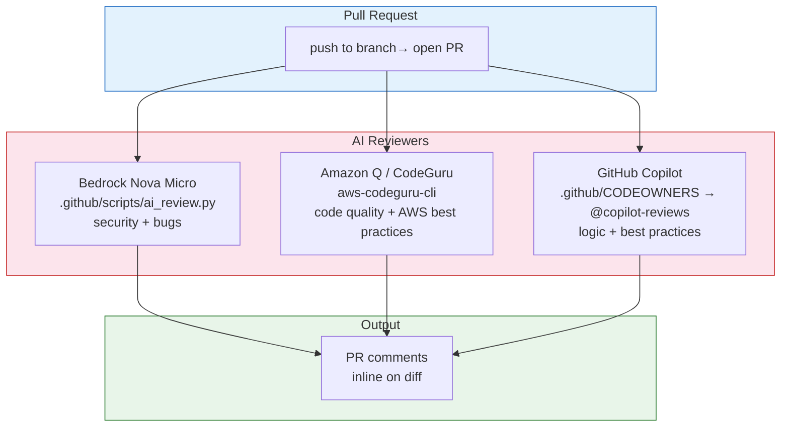

# HOWTO — mail-parquet-lake

End-to-end setup: Gmail API → Parquet on S3 → DuckDB → Markdown for AI agents.

## Prerequisites

- Python 3.13+
- AWS CLI configured (`aws configure`)
- A Google Cloud project with billing enabled
- `make` (ships with macOS / Xcode CLI tools)

## 1. Clone and create venv

```bash
git clone <repo-url> && cd mail-parquet-lake
python3 -m venv venv
source venv/bin/activate
pip install -r requirements.txt
```

## 2. Create the S3 bucket

```bash
aws s3 mb s3://<your-bucket-name> --region us-west-2
```

## 3. Configure environment

```bash
cp .env.example .env
```

Edit `.env`:

```
S3_BUCKET=<your-bucket-name>
S3_PREFIX=<your-prefix>
AWS_REGION=us-west-2
GMAIL_ACCOUNT=<you@gmail.com>
GMAIL_CREDENTIALS_FILE=credentials.json
GMAIL_TOKEN_FILE=token.json
GMAIL_USER=me
```

> **Security:** `.env`, `credentials.json`, and `token.json` are all in `.gitignore`. Never commit them.

## 4. Set up Gmail API credentials

### 4a. Create a Google Cloud project

1. Go to [Google Cloud Console](https://console.cloud.google.com/)
2. Create a new project (or select an existing one)
3. Navigate to **APIs & Services → Library**
4. Search for **Gmail API** and click **Enable**

### 4b. Configure OAuth consent screen

1. Go to **APIs & Services → OAuth consent screen**
2. Choose **External** user type (or Internal if using Google Workspace)
3. Fill in the required fields:
   - App name: `mail-parquet-lake` (or anything you like)
   - User support email: your email
   - Developer contact: your email
4. Under **Scopes**, add: `https://www.googleapis.com/auth/gmail.readonly`
5. Under **Test users**, add your Gmail address
6. Click **Save**

### 4c. Create OAuth 2.0 credentials

1. Go to **APIs & Services → Credentials**
2. Click **Create Credentials → OAuth client ID**
3. Application type: **Desktop app**
4. Name: `mail-parquet-lake`
5. Click **Create**
6. Download the JSON file and save it as `credentials.json` in the project root

### 4d. Authorize (first run)

The first time you run the sync, a browser window opens for OAuth consent:

```bash
make sync-full
```

This creates `token.json` locally. Subsequent runs reuse it automatically.

> **Security:** `credentials.json` and `token.json` are gitignored. If you revoke access, delete `token.json` and re-authorize.

## 5. Initial full sync

```bash
make sync-full
```

This pulls all Gmail messages and writes Parquet files to:

```
s3://<your-bucket-name>/<your-prefix>/year=YYYY/month=MM/emails.parquet
```

Plus `sync_state.json` with the latest `history_id` for delta sync.

## 6. Incremental sync

```bash
make sync
```

Uses Gmail `history.list` API to fetch only new/deleted messages since last sync. Run on a cron for continuous updates:

```bash
# crontab -e
*/15 * * * * cd /path/to/mail-parquet-lake && venv/bin/python sync/gmail_sync.py --incremental
```

## 7. Export to Markdown

```bash
make export DAYS=30 FILTER="recruiter"
```

Writes `.md` files to `export/output/` for AI agents to consume.

## 8. Query with DuckDB

```bash
make query Q="invoice last 30 days"
```

Or interactively:

```python
import duckdb
duckdb.sql("""
    SELECT date, from_addr, subject
    FROM read_parquet('s3://<your-bucket-name>/<your-prefix>/**/*.parquet')
    ORDER BY date DESC
    LIMIT 20
""").show()
```

## 9. Job search tracker

```bash
# Pipeline dashboard — last 30 days
make jobs

# Markdown output
make jobs-md DAYS=60
```

Tune keywords, stages, and ignored domains in `agent/job_tracker.yaml`. See [docs/job-tracker.md](job-tracker.md) for full details.

## 10. GitHub Actions (CI)

Sync and job tracking run automatically via GitHub Actions:

| Workflow | Schedule | On-demand |
|---|---|---|
| Gmail Sync | Daily 9am ET | ✅ (incremental/full) |
| Job Tracker | Daily 10am ET | ✅ |

Setup:

1. Deploy OIDC IAM role:
   ```bash
   cd infra && terraform init && terraform apply
   ```

2. Set GitHub secrets (or use `gh`):
   ```bash
   gh secret set AWS_ACCOUNT_ID --body "<your-account-id>"
   gh secret set S3_BUCKET --body "<your-bucket>"
   gh secret set S3_PREFIX --body "<your-prefix>"
   gh secret set GMAIL_ACCOUNT --body "<your-email>"
   gh secret set GMAIL_CREDENTIALS_JSON < credentials.json
   gh secret set GMAIL_TOKEN_JSON < token.json
   ```

3. Trigger on demand: **Actions → workflow → Run workflow**

See [docs/job-tracker.md](job-tracker.md) for full CI documentation.

## 11. AI code review (3 engines on every PR)

Every pull request is reviewed by three AI engines simultaneously:



| Engine | How it runs | What it catches | Cost |
|---|---|---|---|
| **Bedrock Nova Micro** | `.github/scripts/ai_review.py` — sends diff to Bedrock API | Security vulns, logic bugs, Python anti-patterns | ~$0.001/review |
| **Amazon Q / CodeGuru** | `aws-codeguru-cli` — AWS ML-powered code analysis | Code quality, concurrency bugs, resource leaks, AWS best practices | Free tier: 100K lines/month |
| **GitHub Copilot** | `.github/CODEOWNERS` → `@copilot-reviews` auto-requested | Logic errors, best practices, performance | Free (Copilot Free) |

### Setup

**Bedrock** — needs static IAM credentials with `bedrock:InvokeModel`:
```bash
gh secret set AWS_ACCESS_KEY_ID --body "<bedrock-only-key>"
gh secret set AWS_SECRET_ACCESS_KEY --body "<bedrock-only-secret>"
```

**Amazon Q / CodeGuru** — uses the OIDC role (already deployed via `infra/iam-github-oidc.tf`). The role needs `codeguru-reviewer:*` permissions (included in the Terraform).

**Copilot** — `.github/CODEOWNERS` is set up with `@copilot-reviews`. Requires **Copilot Enterprise** or **Copilot Pro+** with code review enabled. On Copilot Free, you can still request reviews manually in the GitHub PR UI if your plan supports it. The CODEOWNERS file is ready for when you upgrade.

### Trigger all three

Open any PR against `main` — all three fire automatically:

```bash
git checkout -b my-feature
# make changes
git add -A && git commit -m "feat: something"
git push -u origin my-feature
gh pr create --fill
```

Results appear as:
- **Bedrock** → comment in PR conversation (markdown)
- **Amazon Q** → inline comments on the diff + summary
- **Copilot** → inline review comments on the diff

### Why three?

They catch different things:
- Bedrock is a raw LLM call — good at reasoning about logic and security in context
- Amazon Q / CodeGuru uses AWS ML models trained on code — catches resource leaks, concurrency bugs, AWS API misuse
- Copilot is trained on GitHub code patterns — strong on idiomatic fixes and best practices

Running all three at $0 (or near-zero) gives you defense in depth with no manual review overhead.

## 12. AI agent integration

### Kiro
Kiro reads `.kiro/specs/` and manages workflows via hooks. Export first, then let Kiro analyze:

```bash
make export DAYS=30
```

### Amazon Q Developer
```bash
make export FILTER="recruiter" DAYS=30
q chat "@export/ summarize recruiter contacts this week"
```

### Ollama (local)
```bash
ollama run llama3
# use tool: query_gmail_lake → DuckDB → S3
```

### Bedrock Agents
Deploy as Lambda Action Group: `query_gmail_lake(query, date_from, date_to)` → DuckDB → S3

## Security checklist

| File | Contains | Gitignored |
|---|---|---|
| `.env` | Bucket name, region, file paths | ✅ |
| `credentials.json` | Google OAuth client ID/secret | ✅ |
| `token.json` | OAuth refresh/access tokens | ✅ |
| `token.pickle` | Legacy token format | ✅ |
| `*.parquet` | Email data | ✅ |
| `export/output/` | Exported markdown with email content | ✅ |

Before open-sourcing, verify nothing sensitive leaked:

```bash
git log --all --diff-filter=A -- '*.json' '.env' '*.parquet'
```

If any sensitive file was ever committed, rewrite history:

```bash
git filter-repo --path credentials.json --invert-paths
git filter-repo --path token.json --invert-paths
git filter-repo --path .env --invert-paths
```

## Troubleshooting

| Problem | Fix |
|---|---|
| `token.json` expired | Delete `token.json`, run `make sync-full` to re-authorize |
| `403 Insufficient Permission` | Check OAuth scope includes `gmail.readonly` |
| `NoSuchBucket` | Verify `S3_BUCKET` in `.env` matches your bucket |
| DuckDB can't read S3 | Run `aws configure` — DuckDB uses your default AWS credentials |
| High S3 transfer cost | Use `aws s3 sync` to cache locally, point DuckDB at local path |
