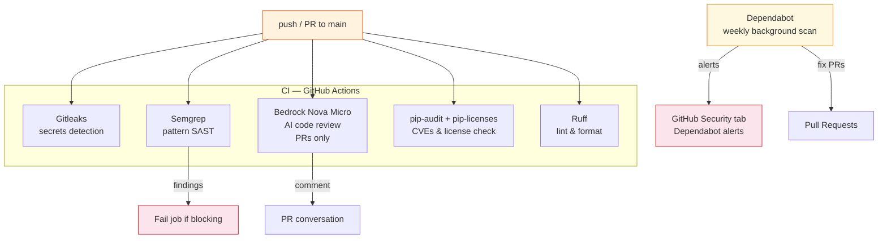
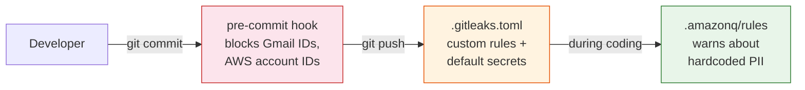

# Security

## Pipeline



Dependabot runs weekly in the background and opens PRs for:
- Python dependency updates (CVEs + version bumps)
- GitHub Actions version updates (supply chain protection)

## GitHub Security Tab

Semgrep runs with `--error` and fails the job on any blocking finding. Output is visible in the workflow log.

Dependabot findings appear under:

```
Repository → Security → Dependabot alerts
```

This tab shows:
- CVEs in your dependencies with severity scores
- Affected package and version range
- Auto-generated fix PRs (one click to merge)

## What Each Tool Catches

| Tool | Type | Examples |
|---|---|---|
| Gitleaks | Secrets | AWS keys, OAuth tokens, passwords in code or git history |
| Semgrep | Pattern SAST | Hardcoded credentials, dangerous function calls, SQL string formatting |
| Bedrock Nova Micro | AI review | Logic bugs, security issues, best practices — on PRs only |
| pip-audit | SCA | Known CVEs in installed packages (e.g. vulnerable boto3 version) |
| pip-licenses | License | GPL/AGPL deps that conflict with your license |
| Dependabot | SCA (async) | New CVEs published after your last push |
| Ruff | Code quality | Unused imports, formatting, style violations |

## Why Semgrep + Bedrock

- **Semgrep** is deterministic pattern matching — fast, reproducible, zero cost, catches known anti-patterns
- **Bedrock Nova Micro** is AI-powered — catches logic bugs and subtle issues that patterns miss, runs only on PRs to keep cost near zero (~$0.001 per review)

Semgrep runs on every push. Bedrock runs only on PRs (where a human will read the feedback).

## Setup

The CI workflows use **GitHub OIDC federation** for AWS S3 access — no static keys.

The Bedrock AI review job still needs static credentials (scoped to `bedrock:InvokeModel` only):

```
Repository → Settings → Secrets and variables → Actions
  AWS_ACCESS_KEY_ID       # for Bedrock only
  AWS_SECRET_ACCESS_KEY   # for Bedrock only
```

All other AWS access (S3 reads/writes) goes through the OIDC role. See [docs/job-tracker.md](job-tracker.md) for OIDC setup.

To check available models:

```bash
aws bedrock list-foundation-models --region us-west-2 \
  --query "modelSummaries[?contains(modelId,'nova')].{id:modelId,name:modelName}" \
  --output table
```

## Not Included

**DAST** (Dynamic Application Security Testing) is not in the pipeline because this project has no running web server. If a Lambda/API Gateway endpoint is added later, OWASP ZAP can be added to the workflow.

## PII Protection

Three layers prevent personal data from leaking into the repo:



| Layer | When | Config | What it catches |
|---|---|---|---|
| Pre-commit hook | Before commit (local) | `hooks/pre-commit` | Gmail numeric IDs, 12-digit AWS account IDs |
| Gitleaks | CI on push/PR | `.gitleaks.toml` | Above + AWS keys, OAuth tokens, passwords in code or history |
| Amazon Q rules | During development | `.amazonq/rules/project.md` | Warns about hardcoded credentials, account IDs, S3 prefixes |

### Install the pre-commit hook

```bash
cp hooks/pre-commit .git/hooks/pre-commit && chmod +x .git/hooks/pre-commit
```

### What gets blocked

| Pattern | Example | Replacement |
|---|---|---|
| Gmail numeric ID | `m1234567890@gmail.com` | `you@gmail.com` |
| AWS account ID | `123456789012` | `${{ secrets.AWS_ACCOUNT_ID }}` or `data.aws_caller_identity` |
| Hardcoded S3 path | `s3://bucket/m1234567890-gmail/` | `s3://{S3_BUCKET}/{S3_PREFIX}/` |

### If PII leaks into PRs

GitHub PRs are immutable — you can't edit or delete them via API. If PII lands in a PR diff or comment, the only fix is to delete and recreate the repo:

```bash
# 1. Delete the repo (needs delete_repo scope)
gh auth refresh -h github.com -s delete_repo
gh repo delete <owner>/<repo> --yes

# 2. Recreate from local clean copy
git remote remove origin
gh repo create <repo> --public --source=. --push

# 3. Re-disable issues
gh repo edit --enable-issues=false

# 4. Re-add secrets in Settings → Secrets → Actions
```

This is why the pre-commit hook and Gitleaks exist — catch it before it reaches GitHub.
