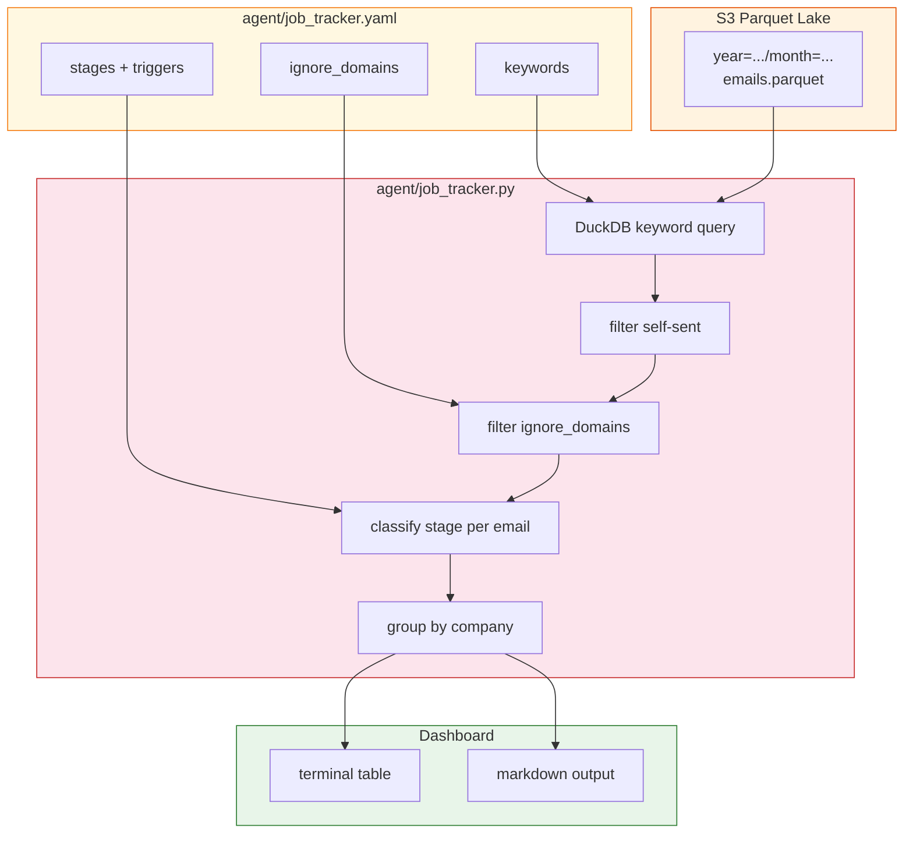
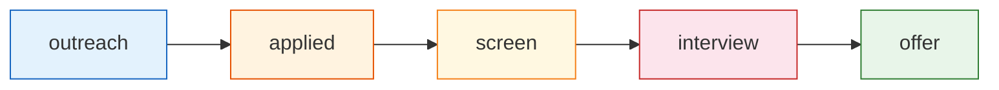
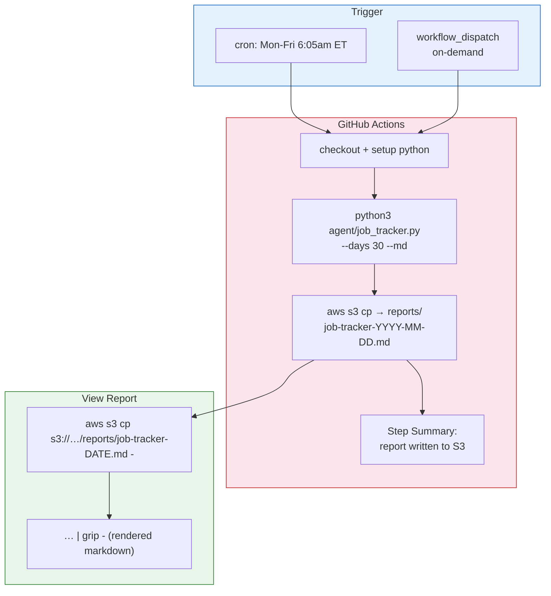
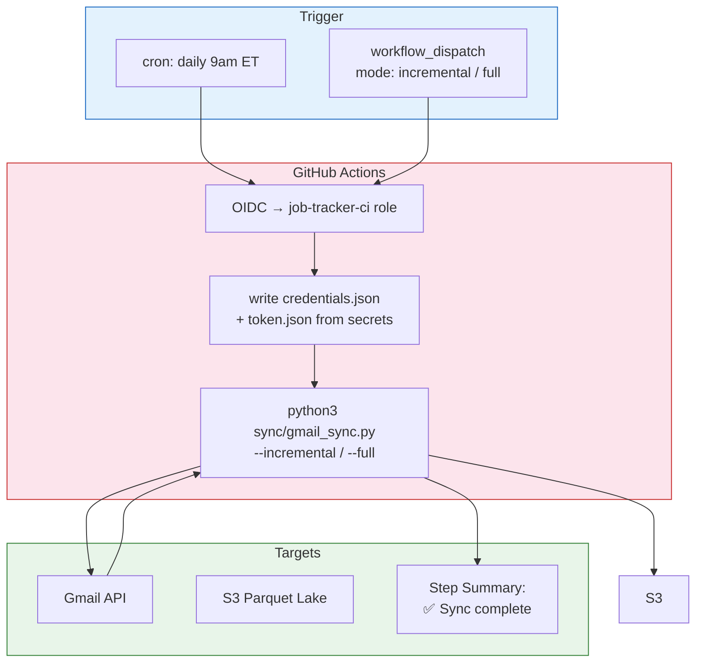

# make jobs — Job Search Pipeline Tracker

Scans the Gmail Parquet lake for job-related emails, classifies each by pipeline stage, and groups by company.

## Architecture



## Pipeline Stages



| Stage | Triggers (from subject + body) |
|---|---|
| **offer** | offer letter, compensation package, background check, start date offer |
| **interview** | interview, scheduling your interview, onsite, phone screen, technical screen, introductory meeting, virtual interview |
| **screen** | assessment, coding challenge, take-home |
| **applied** | your application, thank you for applying, thanks for applying, we've received your, application moved |
| **outreach** | recruiter, recruiting, job opportunity, we'd like to invite, role, position, candidate |

Each company is assigned its **most advanced** stage across all matching emails.

Results are sorted by **most recent activity first** (reverse chronological).

## Usage

```bash
# Default — last 30 days, terminal table
make jobs

# Custom date range
make jobs DAYS=90

# Markdown output (for AI agents)
make jobs-md DAYS=60
```

## Configuration

All tuning lives in `agent/job_tracker.yaml` — no code changes needed.

### Ignore a noisy domain

```yaml
ignore_domains:
  - annoying-newsletter.com    # also catches sub.annoying-newsletter.com
```

### Add a keyword

```yaml
keywords:
  - new keyword here
```

### Add or edit a stage

```yaml
stages:
  - name: offer
    triggers:
      - offer letter
      - compensation package
      - new trigger here
```

## GitHub Actions (scheduled + on-demand)

The workflow runs Mon-Fri at 6:05am ET and writes the report to **S3** (not GitHub Step Summary — keeps PII private on a public repo).



### How to view the report

```bash
# Latest report
aws s3 cp s3://$S3_BUCKET/$S3_PREFIX/reports/job-tracker-$(date +%Y-%m-%d).md -

# Rendered in browser
aws s3 cp s3://$S3_BUCKET/$S3_PREFIX/reports/job-tracker-$(date +%Y-%m-%d).md - | grip -
```

### Run on demand

```bash
gh workflow run "Job Tracker"
# or: Actions → Job Tracker → Run workflow
```

### IAM setup

Uses **GitHub OIDC federation** — no long-lived AWS keys. GitHub Actions assumes a role with short-lived credentials scoped to read-only on your S3 prefix.

Terraform files in `infra/`:

| File | What it creates |
|---|---|
| `provider.tf` | AWS provider config (us-west-2) |
| `iam-github-oidc.tf` | OIDC provider + `job-tracker-ci` role |

```bash
cd infra
terraform init && terraform apply
```

### Required secrets

Set these in **Settings → Secrets and variables → Actions**:

| Secret | Value |
|---|---|
| `AWS_ACCOUNT_ID` | Your 12-digit AWS account ID |
| `S3_BUCKET` | `mail-parquet-lake` |
| `S3_PREFIX` | `your-prefix` |
| `GMAIL_ACCOUNT` | your Gmail address (for self-sent filtering) |

No `AWS_ACCESS_KEY_ID` / `AWS_SECRET_ACCESS_KEY` needed — OIDC handles auth.

### Workflow file

`.github/workflows/job-tracker.yml` — edit the cron schedule to change frequency.

## Gmail Sync (scheduled + on-demand)

The sync workflow runs daily at 9am ET (one hour before the job tracker) and can also be triggered on demand with a mode selector.



### Run on demand

```bash
gh workflow run "Gmail Sync"
# or: Actions → Gmail Sync → Run workflow → select mode
```

### Daily schedule

| Workflow | Cron | Time (ET) |
|---|---|---|
| Gmail Sync | Mon-Fri 6am | 6:00am |
| Job Tracker | Mon-Fri 6:05am | 6:05am |

Sync runs first so the job tracker sees fresh data.

### Additional secrets for sync

| Secret | How to get it |
|---|---|
| `GMAIL_CREDENTIALS_JSON` | Contents of your `credentials.json` (OAuth client) |
| `GMAIL_TOKEN_JSON` | Contents of your `token.json` (run `make sync` locally once to generate) |

The token contains a refresh token — Gmail API uses it to get short-lived access tokens automatically. No browser needed in CI.

### Workflow file

`.github/workflows/gmail-sync.yml`

## Example Output

```
           Company     Stage  Emails Last Activity  Latest Subject                                                    Contacts
     Thefitchgroup interview       3    2026-04-08  Your Virtual Interview with Fitch is Confirmed - (Technology O…         2
            Dexian interview       2    2026-04-08  How was your experience with Dexian?                                    2
               Ibm interview       3    2026-04-01  Re: interview                                                          1
             Braze   applied       1    2026-04-08  Thank you for applying to Braze!                                       1
           Ashbyhq   applied       6    2026-04-08  Thanks for applying to Tetrix!                                         6
      Stafflinepro   applied       4    2026-04-03  Your application moved to next stage                                   2
        Intellectt  outreach       4    2026-04-03  Re: Job Title: Elastic Platform Engineer (DE)--Remote                  1
```
